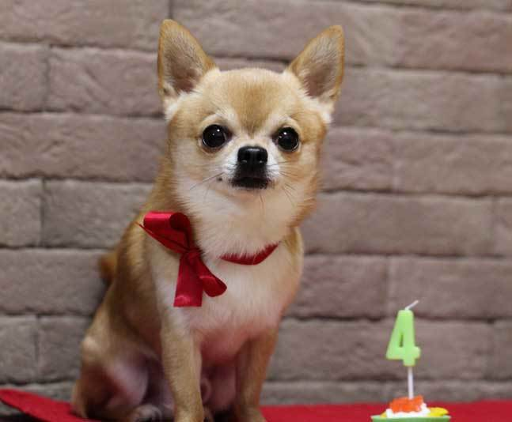
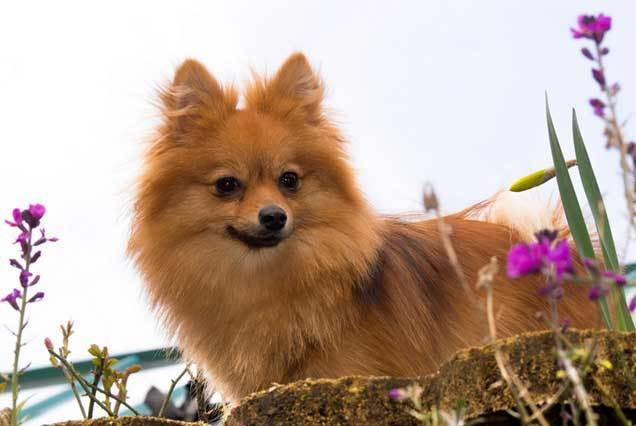
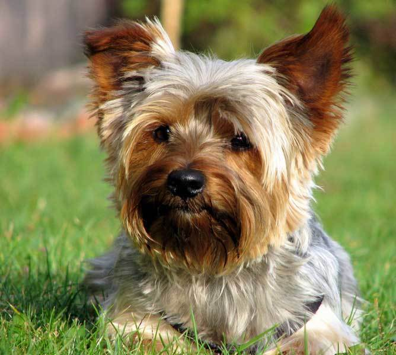

# Топ-3 самых маленьких пород собак

## Почему заводят маленьких собак?

Большую роль в популярности миниатюрных пород сыграла мода. На обложках модных журналов мелькают стильные девушки с собачками в руках, знаменитые люди в интервью упоминают про своих крошечных любимцев. Всё это действует на подсознание людей, особенно девушек и женщин, которые воспринимают наличие собачки как часть успешного имиджа.

### Чихуахуа

Самой маленькой породой собак в мире признана чихуахуа. Стандартный рост этих крошек – 15-23 см, а вес варьируется в пределах 3 кг. Но в селекции происходят и настоящие чудеса, когда на свет появляются совершенно игрушечные собачки, как например чихуахуа Милли с рекордным для собаки ростом 9,6 см и весом 500 гр. Представьте, как нужно бережно общаться с таким маленьким питомцем, а корм она способна поглощать только маленькими каплями.

### Померанский шпиц

Вы очарованы пушистым комочком под названием померанский шпиц? Вы не одиноки, под его очарование попадали многие известные люди: королевы, писатели, художники и кумиры современности. Рост этой собаки не более 22 см, но из-за вертикально стоящего подшёрстка, они кажутся несколько крупнее. Вес померанских шпицев не более 3,5 кг. Они будут идеальными компаньонами практически для любого человека.

### Йоркширский терьер

В последнее 10-летие к этой породе появилось повышенное внимание. Йоркширские терьеры сейчас на пике популярности из-за своей внешности и интересного характера. С таким домашним любимцем вы никогда не соскучитесь, он приносит массу положительных эмоций своим владельцам благодаря пылкому нраву и решительному характеру.

КОД ТРЕКЕРА? 
